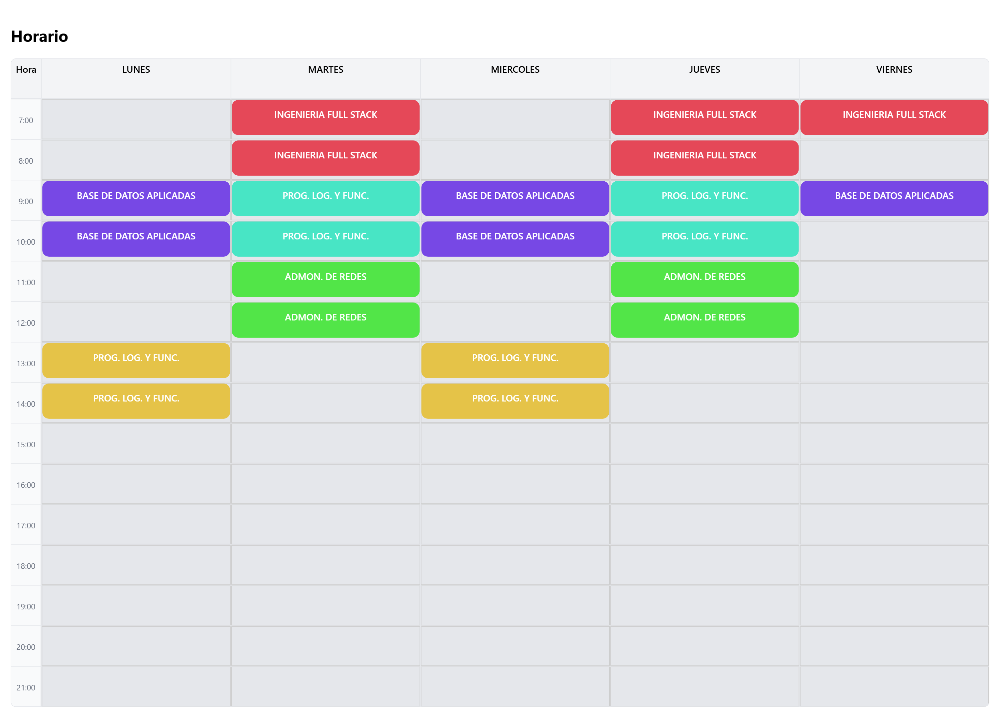

# 📅 SchTrack – Planificador de Horario Interactivo

SchTrack es una aplicación web interactiva para crear y organizar horarios académicos de forma visual e intuitiva.  
Permite agregar materias, asignarlas a un horario mediante **drag & drop**, limpiar paneles y **exportar el horario como imagen**.

Este proyecto fue desarrollado como práctica de frontend, enfocado en **UX, estado de la aplicación y manipulación visual**.

---

## 🚀 Demo en vivo

🔗 https://80chucho08.github.io/schtrack/

---

## 🖼️ Vista previa

### Panel de materias y horario

### Exportación del horario

> 📌 *Las imágenes muestran el funcionamiento real de la aplicación.*

---

## ✨ Características principales

- ➕ Agregar materias con nombre y color personalizado
- 🧲 Arrastrar y soltar materias al horario (Drag & Drop)
- 🗂️ Panel de materias dinámico
- 🧹 Limpiar panel o limpiar horario completo
- 🖨️ Exportar el horario como imagen (PNG)
- 💾 Persistencia con LocalStorage
- 📱 Diseño responsive y limpio

---

## 🛠️ Tecnologías utilizadas

- **React + TypeScript**
- **Vite**
- **@dnd-kit** – Drag & Drop
- **html2canvas** – Exportación a imagen
- **CSS puro** (Grid & Flexbox)
- **GitHub Pages** – Deploy

---

## 🧠 Conceptos aplicados

- Manejo de estado con `useState` y `useEffect`
- Persistencia de datos en `localStorage`
- Arquitectura por componentes
- CSS Grid para layout de horarios
- Separación de lógica y UI
- Buenas prácticas de React (keys, props, tipado)

---

## 📂 Estructura del proyecto

src/
├── components/
│ ├── HorarioGrid.tsx
│ ├── CeldaHorario.tsx
│ ├── PanelMaterias.tsx
│ ├── MateriaCard.tsx
│ └── FormMateria.tsx
├── pages/
│ └── SchedulePage.tsx
├── types/
│ └── schedule.ts
├── App.tsx
└── main.tsx

👤 Autor

Jesús Carbajal
💻 Estudiante de Ingeniería en Sistemas
📍 México